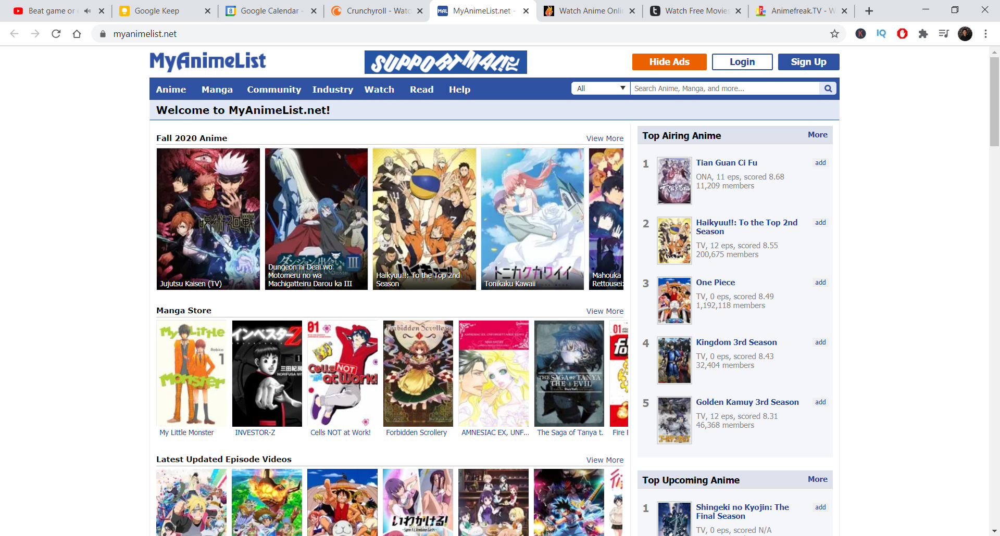
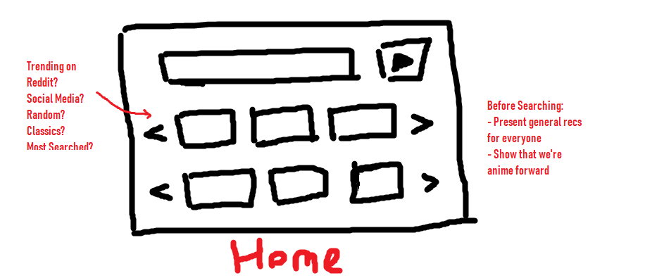
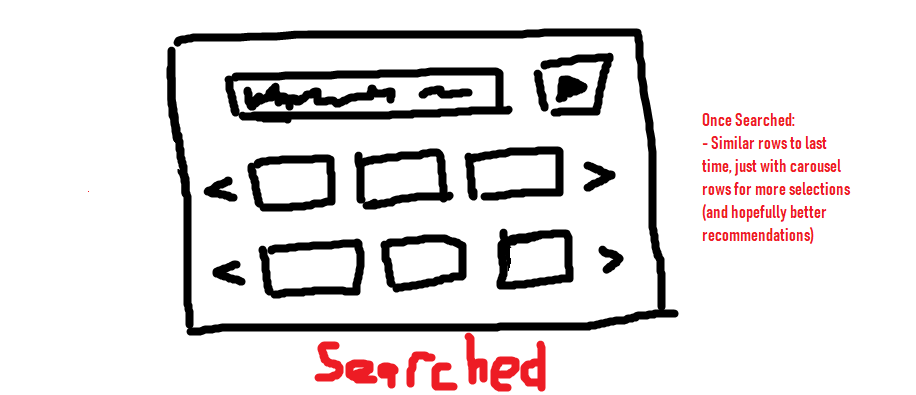
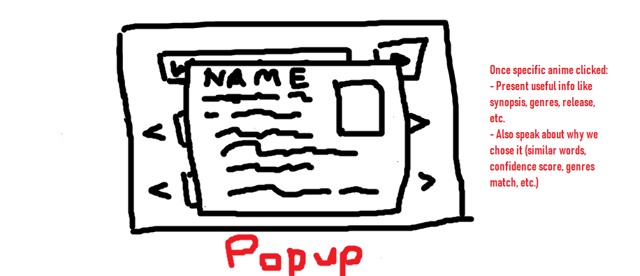

# AnimeRec: Second Cycle Pitch

## Problem
Main premise: This is the continuation of the Anime Recommendation System project where our main goal was automating the process of anime recommendations. Recs for anime as it currently stands stems from 3 prime sources: friends, youtubers who speak on generally well received anime (Anitubers - produce videos about best of the season/year/decade), and crowd sourced recs (MyAnimeList - which has "if you liked X, you'll like Y" recs that are user submitted). These were all manual and required some digging if you wanted to get a whole list of anime to watch based on your personal preferences while also taking into account new and popular anime.

As we've learnt from the UX research from Cycle 1, the main problems faced were:
1. Trust in the algorithms and the website 
    - Not enough anime posters off the bat. E.g. MyAnimeList homepage: 
    - Algorithm results were not as expected - stein's gate queried, no re:zero recommended
    - People didn't understand how the algorithms worked
    - No sense of credibility - reddit upvotes or MAL number of users recommended)
    - Etc. (learn more from [Joey's UX Research](https://github.com/chriskok/AnimeRec/tree/master/management))
2. Differentiation and benefit compared to other sources of recommendations
    - Why should people use this over any other source? Is it because we can immediately get answers? Do we help people aggregate information in a better way?

## Solution
### The backend 
- Scrape 'truth' data from other sources (Anime-Planet, MyAnimeList, etc.). 
   - This is to be used for validation on our current algorithms 
   - This can also further establish credibility through explainable AI upon learning about what makes particular anime more likely to be recommended (MAL has reasons like: "they both have strong female lead characters")
- Scrape other useful sources of data for aggregating and presenting wanted information (reddit, where-to-watch, etc.)
   - Reddit: They have recent in-season anime that are constantly voted on. Upon arrival at the hompage we can suggest ones that are more general based on trending anime currently.
   - Where to Watch: We can present this information in the pop-up if a user wants to know.
   - AniDB: character traits can be used for explainability
- Add on different features to our algorithms like genres (randomanime.org has amazing traffic with just matching the genres - we can also match them first before using review similiarity), plot style (e.g. comedy plots could be written differently than drama), character traits (from AniDB), etc.
- Feed more information to the front-end (jap/english titles, genres for each anime, etc.)
- Improve preprocessing for text-based similarity recommendations (stripping entities, etc.)

### The frontend 
- More visuals on the homepage and a more professional design in general

- Allow for more recommendations with a carousel

- Better, more useful information in the pop-up (either for credibility or benefit - like where to watch, number of users recommended through MAL, etc.)

- Move like/dislike button to inside the popup

## Rabbit Holes
Here are some details about the solution worth calling out to avoid future problems:
- Will it be possible to scrape from MAL's recommendations with the Jikan API that we've used - will it take too long to use typical webscraping tools like beautifulsoup?
- Will we be allowed to take the information gathered from reddit upvotes? We may need to ask for admin permission before grabbing that data. If allowed, scraping from reddit is easy with python!
- Where do we get "where to watch" data? I haven't found an easy solution personally but I don't have the internet rn to really search for one... My guess is there could be an API for each individual platform (crunchyroll, netflix, etc.)
- Might need a complete redesign and code from the ground up for the frontend. E.g. carousel rows were difficult to do with dynamic data from the last cycle (but we can cut down the scope for it if necessary). Plus it could make it more professional in general.

## No-Gos
These represent things we want to conciously and actively avoid this cycle (but they stand as good ideas going into future ones):
- Selection of multiple animes for more personalization
- Filtering by genres or any specific tags
- Allow users to select and avoid previously watched anime from being recommended
- Computer Vision techniques for poster or artstyle similarity to feed into existing algorithms
- Adding more rows with different algorithms (potentially collaborative filtering in the future)
- Adding more randomness to recommendations

## Competition
- https://www.randomanime.org/anime-like/ranma/
- http://animesuggestions.com/?name=Attack+on+Titan&method=best
- https://myanimelist.net/anime/40748/Jujutsu_Kaisen_TV/userrecs
- https://www.anime-planet.com/anime/boruto-naruto-next-generations/recommendations

## Credits
- Basecamp's Shape-Up Guidelines: https://basecamp.com/shapeup/1.5-chapter-06
- Joey's UX Research Document: https://github.com/chriskok/AnimeRec/tree/master/management