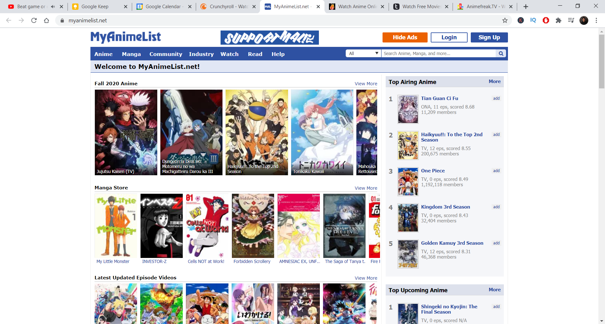

# Rekku: Third Cycle Pitch

## Problem
WE have to get the API ready for integration with randomanime.org. Currently more trustworthy with infromation regarding user based recommendations but not fully differentiated with things like "similar characters" and "similar detailed tags".

As we've learnt from the UX research from Cycle 1, the main problems faced were:
1. Trust in the algorithms and the website 
    - Not enough anime posters off the bat. E.g. MyAnimeList homepage: 
    - Algorithm results were not as expected - stein's gate queried, no re:zero recommended
    - People didn't understand how the algorithms worked
    - No sense of credibility - reddit upvotes or MAL number of users recommended)
    - Etc. (learn more from [Joey's UX Research](https://github.com/chriskok/AnimeRec/tree/master/management))
2. Differentiation and benefit compared to other sources of recommendations
    - Why should people use this over any other source? Is it because we can immediately get answers? Do we help people aggregate information in a better way?

## Solution
### The backend 
- Scrape data on detailed tags
- Provide character similarity metrics in our knowledge graphs
- Produce recommendations for differentiation

### The frontend 
- Make it presentable to Kyle, think about wh at it would take for integration on his PHP stuff

## Rabbit Holes
Here are some details about the solution worth calling out to avoid future problems:
- Will it be possible to scrape from MAL's recommendations with the Jikan API that we've used - will it take too long to use typical webscraping tools like beautifulsoup?
- Will we be allowed to take the information gathered from reddit upvotes? We may need to ask for admin permission before grabbing that data. If allowed, scraping from reddit is easy with python!
- Where do we get "where to watch" data? I haven't found an easy solution personally but I don't have the internet rn to really search for one... My guess is there could be an API for each individual platform (crunchyroll, netflix, etc.)
- Might need a complete redesign and code from the ground up for the frontend. E.g. carousel rows were difficult to do with dynamic data from the last cycle (but we can cut down the scope for it if necessary). Plus it could make it more professional in general.

## No-Gos
These represent things we want to conciously and actively avoid this cycle (but they stand as good ideas going into future ones):
- Selection of multiple animes for more personalization
- Filtering by genres or any specific tags
- Allow users to select and avoid previously watched anime from being recommended
- Computer Vision techniques for poster or artstyle similarity to feed into existing algorithms
- Adding more rows with different algorithms (potentially collaborative filtering in the future)
- Adding more randomness to recommendations

## Credits
- N/A